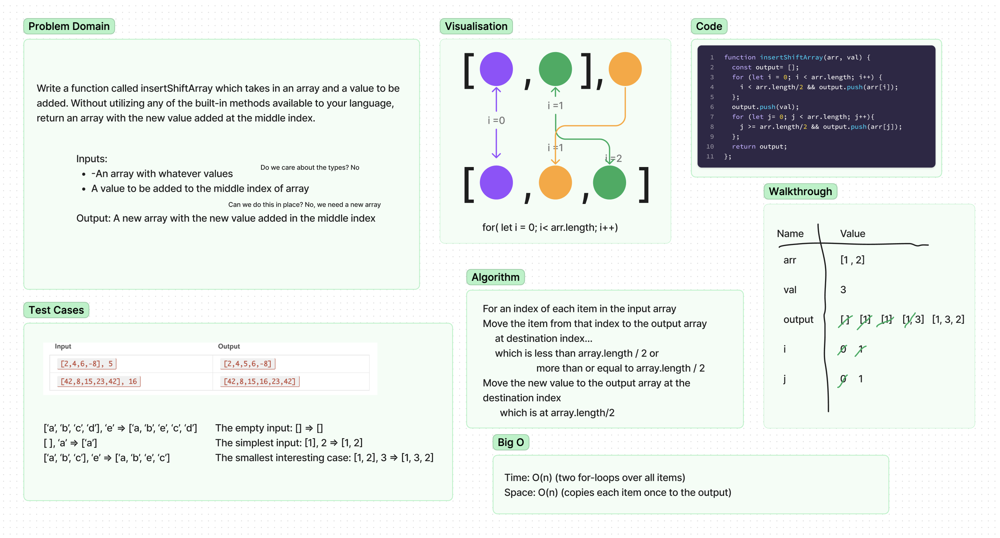

# Insert and shift an array in middle at index

> Write a function called `insertShiftArray` which takes in an array and a value to be added. Without utilizing any of the built-in methods available to your language, return an array with the new value added at the middle index.

## Whiteboard Process

## Approach & Efficiency

This assignment took me about 1.5 hours. I am still confused about some of the concepts and need to study them more.

Time: O(n) (two for-loops over all items)
Space: O(n) (copies each item once to the output)
