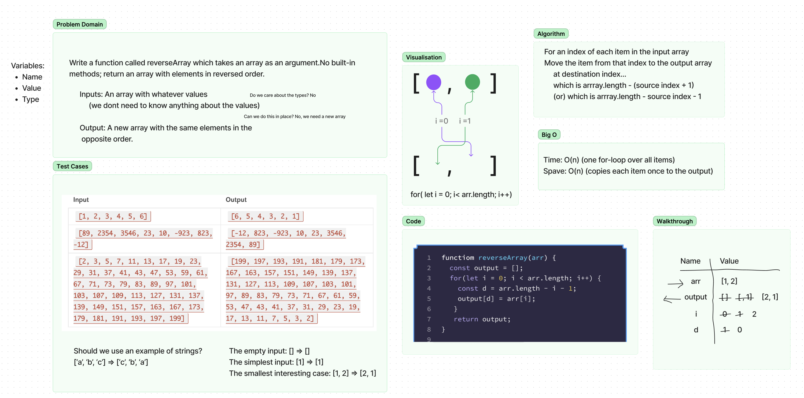

# Reverse an Array

> Write a function called reverseArray which takes an array as an argument. Without utilizing any of the built-in methods available to your language, return an array with elements in reversed order.

## Whiteboard Process

## Approach & Efficiency

This was my first introduction to using a whiteboard to solve a code challenge. I completed the assignment while following along during lecture

Time: O(n) (one for-loop over all items)
Space: O(n) (copies each item once to the output)
