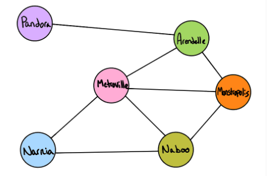
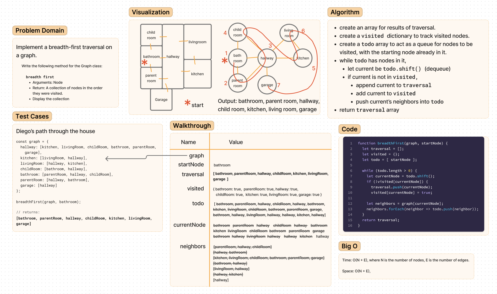

# Code Challenge: Class 36

Implement a breadth-first traversal on a graph.

## Feature Tasks

Write the following method for the Graph class:

- breadth first
- Arguments: Node
- Return: A collection of nodes in the order they were visited.
- Display the collection

## Testing

Write at least three test assertions for each method that you define.

### Example

Output:
`Pandora, Arendelle, Metroville, Monstroplolis, Narnia, Naboo`

### Stretch Goal

Once you’ve achieved a working solution, define a new method that accepts two nodes as input and uses your traversal algorithm to determine if a path exists between the two nodes.

## Whiteboard Process

<!-- ## Approach & Efficiency -->
<!-- What approach did you take? Why? What is the Big O space/time for this approach? -->

<!-- ## Solution -->
<!-- Show how to run your code, and examples of it in action -->
