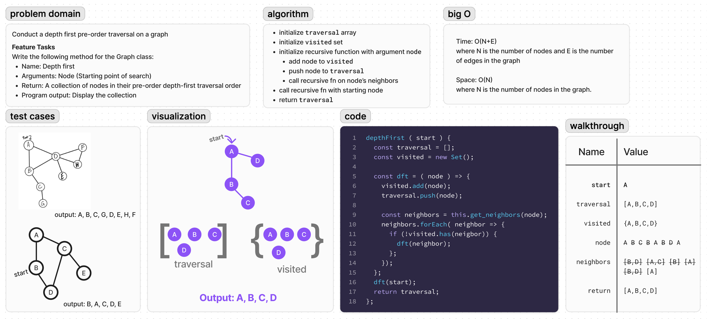

# Code Challenge: Class 38

Conduct a depth first pre-order traversal on a graph

## Feature Tasks

Write the following method for the Graph class:

- Name: Depth first
- Arguments: Node (Starting point of search)
- Return: A collection of nodes in their pre-order depth-first traversal order
- Program output: Display the collection

## Whiteboard

