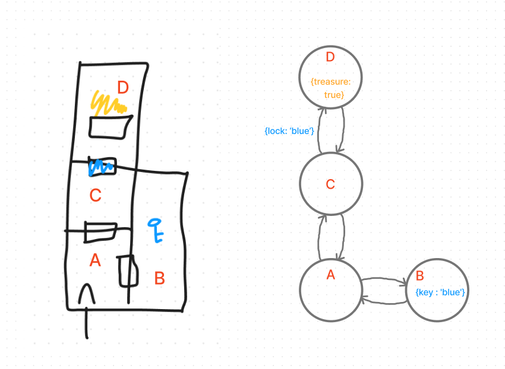

# Code Challenge: Class 35: Graph Implementation

## Features

Implement your own Graph. The graph should be represented as an adjacency list, and should include the following methods:

- __add node__
  - Arguments: value
  - Returns: The added node
  - Add a node to the graph
- __add edge__
  - Arguments: 2 nodes to be connected by the edge, weight (optional)
  - Returns: nothing
  - Adds a new edge between two nodes in the graph
  - If specified, assign a weight to the edge
  - Both nodes should already be in the Graph
- __get nodes__
  - Arguments: none
  - Returns all of the nodes in the graph as a collection (set, list, or similar)
  - Empty collection returned if there are no nodes
- __get neighbors__
  - Arguments: node
  - Returns a collection of edges connected to the given node
    - Include the weight of the connection in the returned collection
  - Empty collection returned if there are no nodes
- __size__
  - Arguments: none
  - Returns the total number of nodes in the graph
  - 0 if there are none

## Testing

Write tests to prove the following functionality:

- Node can be successfully added to the graph
- An edge can be successfully added to the graph
- A collection of all nodes can be properly retrieved from the graph
- All appropriate neighbors can be retrieved from the graph
- Neighbors are returned with the weight between nodes included
- The proper size is returned, representing the number of nodes in the graph
- A graph with only one node and edge can be properly returned

## UML

