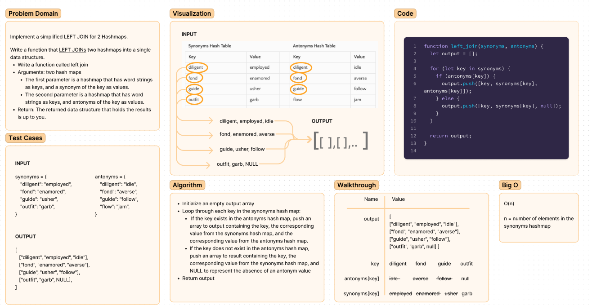

# Code Challenge: Class 33

Implement a simplified `LEFT JOIN` for 2 Hashmaps.

> The SQL `LEFT JOIN` returns all rows from the left table, even if there are no matches in the right table. This means that if the ON clause matches 0 (zero) records in the right table; the join will still return a row in the result, but with NULL in each column from the right table.
>
> This means that a left join returns all the values from the left table, plus matched values from the right table or NULL in case of no matching join predicate.
>
> ## Syntax
>
> The basic syntax of a `LEFT JOIN` is as follows.
>
> ``` js
> SELECT table1.column1, table2.column2...
> FROM table1
> LEFT JOIN table2
> ON table1.common_field = table2.common_field;
> ```
>
## Feature Tasks

Write a function that `LEFT JOIN`s two hashmaps into a single data structure.

- Write a function called left join
- Arguments: two hash maps
  - The first parameter is a hashmap that has word strings as keys, and a synonym of the key as values.
  - The second parameter is a hashmap that has word strings as keys, and antonyms of the key as values.
- Return: The returned data structure that holds the results is up to you. It doesn’t need to exactly match the output below, so long as it achieves the LEFT JOIN logic

### NOTES:

- Combine the key and corresponding values (if they exist) into a new data structure according to LEFT JOIN logic.
- LEFT JOIN means all the values in the first hashmap are returned, and if values exist in the “right” hashmap, they are appended to the result row.
- If no values exist in the right hashmap, then some flavor of `NULL` should be appended to the result row.

## Whiteboard


