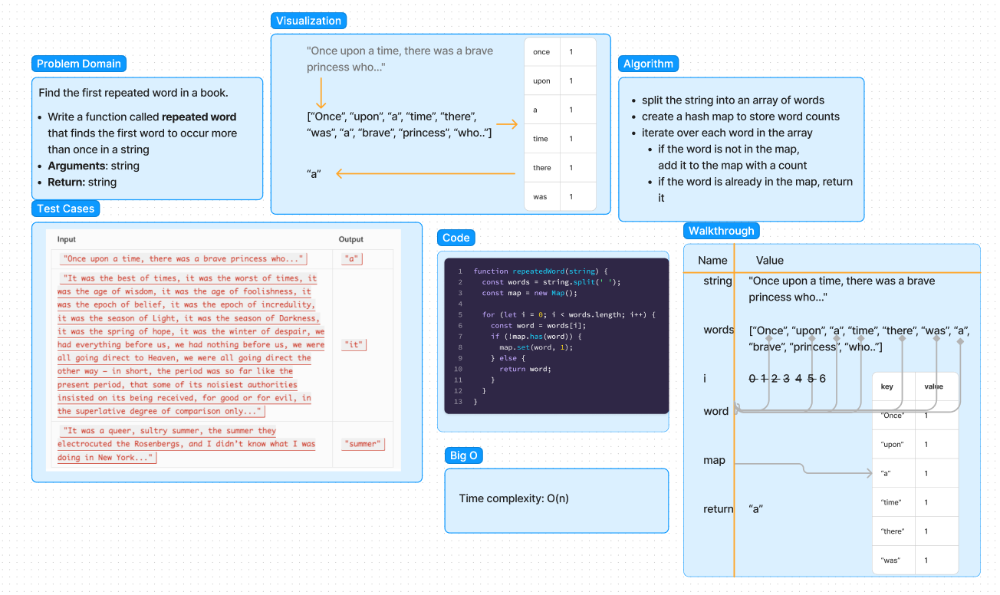

# Code Challenge - Class 31
<!-- Description of the challenge -->
Find the first repeated word in a book

Feature Tasks:

- Write a function called `repeated word` that finds the __first word to occur more than once in a string__
  - Arguments: string
  - Return: string

## Whiteboard Process
<!-- Embedded whiteboard image -->




## Approach & Efficiency
<!-- What approach did you take? Why? What is the Big O space/time for this approach? -->
The time complexity of my approach is `O(n)`. I am iterating on each word in the array until I get to the one that is repeated. `n` is the number of words it takes me to find the repeated one.

## Solution
<!-- Show how to run your code, and examples of it in action -->
```js
string= "Once upon a time, there was a brave princess who..."

repeatedWord(string) --> 'a'
```
