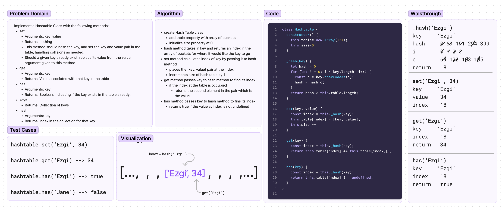

# Challenge Title : Class 30: Hash Table Implementation
<!-- Description of the challenge -->
Implement a Hashtable Class with the following methods:

- `set`
  - Arguments: key, value
  - Returns: nothing
  - This method should hash the key, and set the key and value pair in the table, handling collisions as needed.
  - Should a given key already exist, replace its value from the value argument given to this method.

- `get`
  - Arguments: key
  - Returns: Value associated with that key in the table

- `has`
  - Arguments: key
  - Returns: Boolean, indicating if the key exists in the table already.

- `keys`
  - Returns: Collection of keys

- `hash`
  - Arguments: key
  - Returns: Index in the collection for that key

Write tests to prove the following functionality:

- Setting a key/value to your hashtable results in the value being in the data structure
- Retrieving based on a key returns the value stored
- Successfully returns null for a key that does not exist in the hashtable
- Successfully returns a list of all unique keys that exist in the hashtable
- Successfully handle a collision within the hashtable
- Successfully retrieve a value from a bucket within the hashtable that has a collision
- Successfully hash a key to an in-range value
- Ensure your tests are passing before you submit your solution.

## Whiteboard Process
<!-- Embedded whiteboard image -->


## Approach & Efficiency
<!-- What approach did you take? Why? What is the Big O space/time for this approach? -->
Time complexity is O(1) in the average case. In the worst case, with many hash collisions, time complexity can become O(n), where n is the number of collisions.

## Solution
<!-- Show how to run your code, and examples of it in action -->
`npm test` runs the test suites

Test example:
```js
  describe('get', () => {
    it('should return the value associated with a key', () => {
      hashtable.set('Ezgi', 34);
      hashtable.set('Jane', 25);

      expect(hashtable.get('Ezgi')).toBe(34);
      expect(hashtable.get('Jane')).toBe(25);
    });
  });
```

