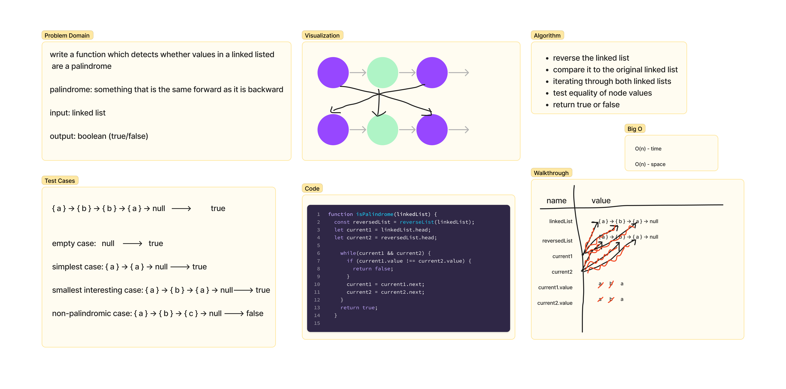

# Code Challenge 9 - Mock Interviews

## Challenge Summary

Interview 02: Validate whether or not a Linked List is palindrome.

## Whiteboard Process

## Approach & Efficiency

David conducted my interview while I utilized the white board to solve the palindrome problem.
I decided to compare a linked list to its reverse to validate it as a palidrome. I was instructed to use the 'built-in' reverse linked-list method and that is what I did.
