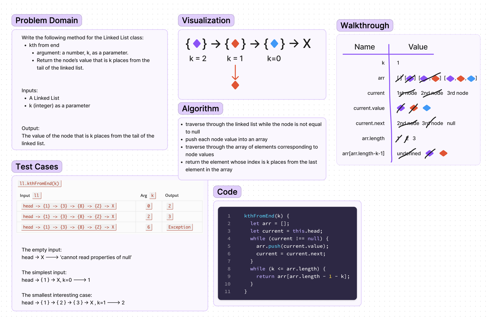

# Code Challenge 7 - kth value from the end of a linked list

## Challenge Summary

Write the following method for the Linked List class:

kth from end

- argument: a number, `k`, as a parameter.

- Return the node’s value that is `k` places from the tail of the linked list.

## Whiteboard Process

## Approach & Efficiency

I had a hard time coming up with a solution while traversing the linked list. I used an array of the node elements and traversed throughb that to find a solution.

