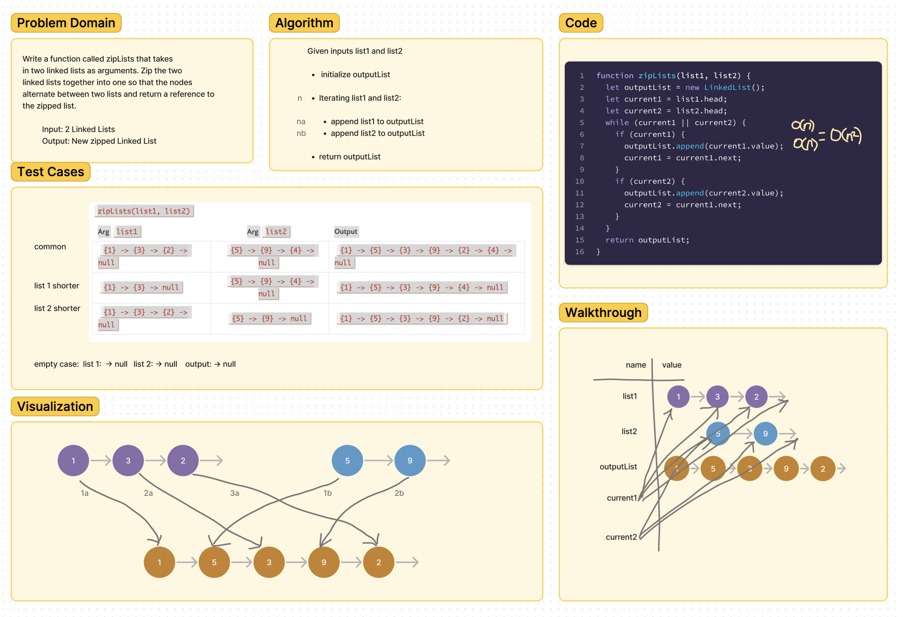

# Code Challenge 8 - Zip two linked lists

## Challenge Summary

- Write a function called zip lists
- Arguments: 2 linked lists
- Return: New Linked List, zipped as noted below
- Zip the two linked lists together into one so that the nodes alternate between the two lists and return a reference to the the zipped list.

## Whiteboard Process

## Approach & Efficiency

I worked together with two of my classmates to put together the initial whiteboard within 45 minutes during class. After the instructor's review, I modified my whiteboard to resemble more of his demo because it was more awesome.
