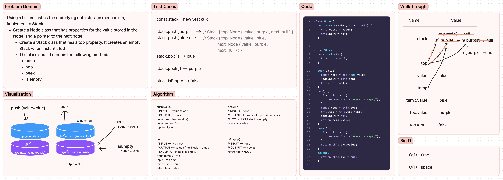

# Code Challenge 10 - Stacks and Queues
<!-- Short summary or background information -->
A stack is a data structure that consists of Nodes. Each Node references the next Node in the stack, but does not reference its previous.

A queue is a data structure that follows the First-In-First-Out (FIFO) principle, where the first element added to the queue is the first one to be removed.

## Challenge
<!-- Description of the challenge -->
Using a Linked List as the underlying data storage mechanism, implement both a Stack and a Queue

## Approach & Efficiency
<!-- What approach did you take? Why? What is the Big O space/time for this approach? -->
I started by creating a figma whiteboard for the Stack class, which lays out the problem domain, algorithm, test cases, visualization and the Big O space/time ( O(1) space, O(1) time ). I then wrote the code and the tests in VS Code, while referring to the algorithm.

## API
<!-- Description of each method publicly available to your Stack and Queue-->
### Stack methods:

- push
  - Arguments: value
  - adds a new node with that value to the top of the stack with an O(1) Time performance.
- pop
  - Arguments: none
  - Returns: the value from node from the top of the stack
  - Removes the node from the top of the stack
  - Should raise exception when called on empty stack
- peek
  - Arguments: none
  - Returns: Value of the node located at the top of the stack
  - Should raise exception when called on empty stack
- is empty
  - Arguments: none
  - Returns: Boolean indicating whether or not the stack is empty.

### Queue methods:

- enqueue
  - Arguments: value
  - adds a new node with that value to the back of the queue with an O(1) Time performance.
- dequeue
  - Arguments: none
  - Returns: the value from node from the front of the queue
  - Removes the node from the front of the queue
  - Should raise exception when called on empty queue
- peek
  - Arguments: none
  - Returns: Value of the node located at the front of the queue
  - Should raise exception when called on empty stack
- is empty
  - Arguments: none
  - Returns: Boolean indicating whether or not the queue is empty

## Whiteboard Process

