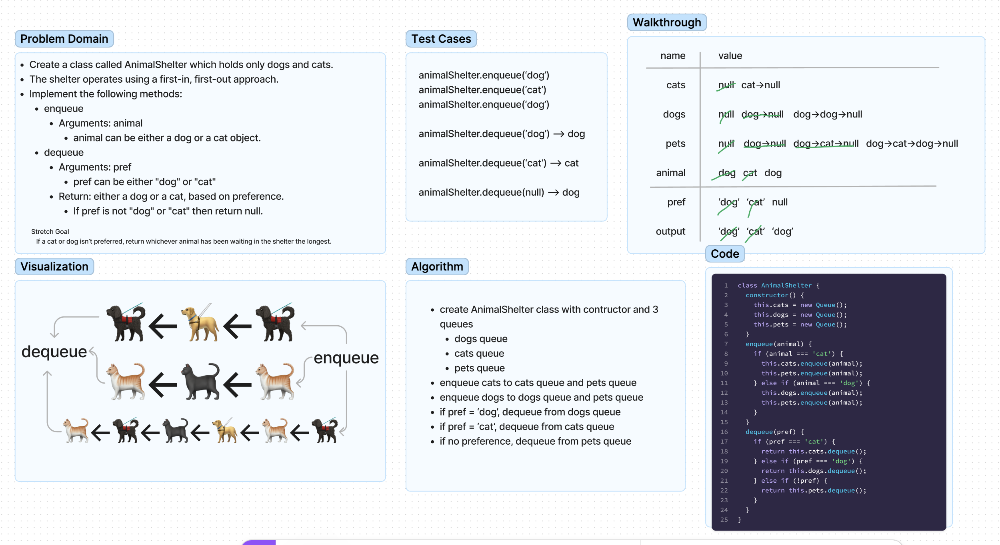

# Code Challenge 12 - Animal Shelter

## Challenge
<!-- Description of the challenge -->
First-in, First out Animal Shelter.

- Create a class called AnimalShelter which holds only dogs and cats.
- The shelter operates using a first-in, first-out approach.

## Approach & Efficiency
<!-- What approach did you take? Why? What is the Big O space/time for this approach? -->
We were instructed to create a whiteboard, then implement the code. It has been difficult for me to work in that order and I ended up writing the code first. I will try to change my approach for the next challenge.

## API
<!-- Description of each method publicly available to your Stack and Queue-->
### Class AnimalShelter methods:

- enqueue
  - Arguments: animal
    - `animal` can be either a dog or a cat object.
- dequeue
  - Arguments: pref
    - `pref` can be either `"dog"` or `"cat"`
  - Return: either a dog or a cat, based on preference.

Stretch Goal
If a cat or dog isn’t preferred, return whichever animal has been waiting in the shelter the longest.

## Whiteboard Process

