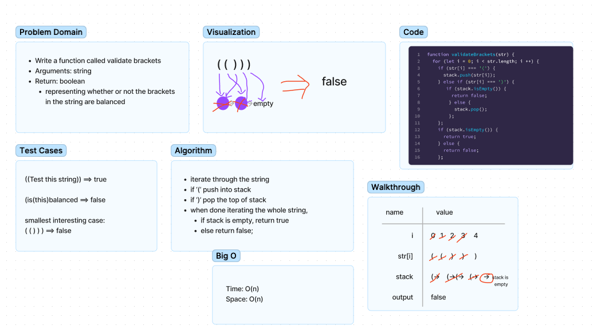

# Code Challenge 13 - Bracket Validation

## Challenge
<!-- Description of the challenge -->
- Write a function called validate brackets
- Arguments: string
- Return: boolean
  - representing whether or not the brackets in the string are balanced

## Approach & Efficiency
<!-- What approach did you take? Why? What is the Big O space/time for this approach? -->
We worked in groups of 3 to create the whiteboard. Andra worked as driver while the rest of us helped navigate.

## Whiteboard Process

