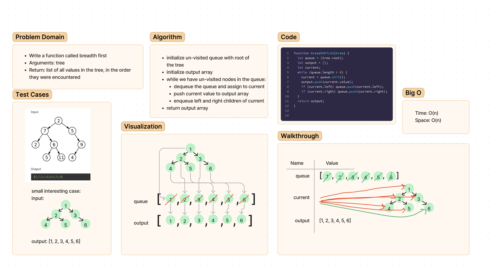

# Challenge Summary
<!-- Description of the challenge -->
Write a function called breadth first

 -Arguments: tree

 -Return: list of all values in the tree, in the order they were encountered

## Whiteboard Process

## Approach & Efficiency

I used an iterative function to traverse the tree, adding nodes to the queue and dequeuing in order to return the values in breadth-first order.
