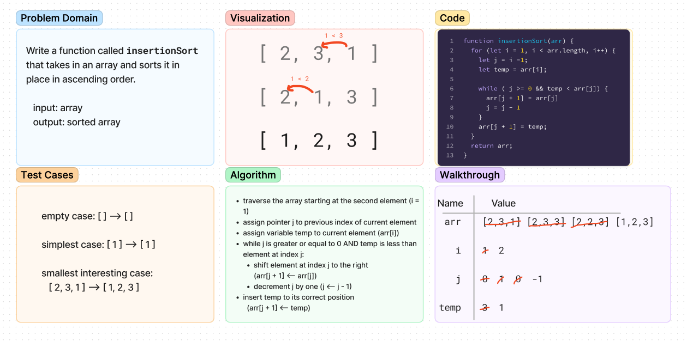

# Code Challenge - Class 26: Insertion Sort

## Challenge Summary
<!-- Description of the challenge -->
Write a function called insertionSort that takes in an array and sorts it in place in ascending order.

## Whiteboard Process
<!-- Embedded whiteboard image -->

## Approach & Efficiency
<!-- What approach did you take? Why? What is the Big O space/time for this approach? -->
Time: O(n^2)  
Space: O(1)
