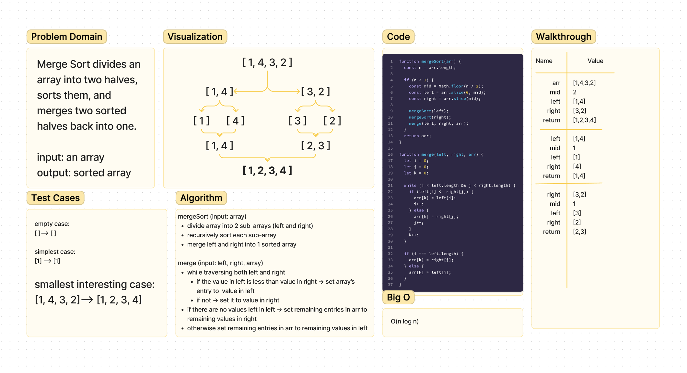

# Code Challenge - Class 27: Merge Sort

## Challenge Summary
<!-- Description of the challenge -->
Merge Sort divides an array into two halves, sorts them, and merges two sorted halves back into one.

input: an array
output: sorted array

## Whiteboard Process
<!-- Embedded whiteboard image -->

## Approach & Efficiency
<!-- What approach did you take? Why? What is the Big O space/time for this approach? -->
Time: O(nlogn)
Space: O(n)
